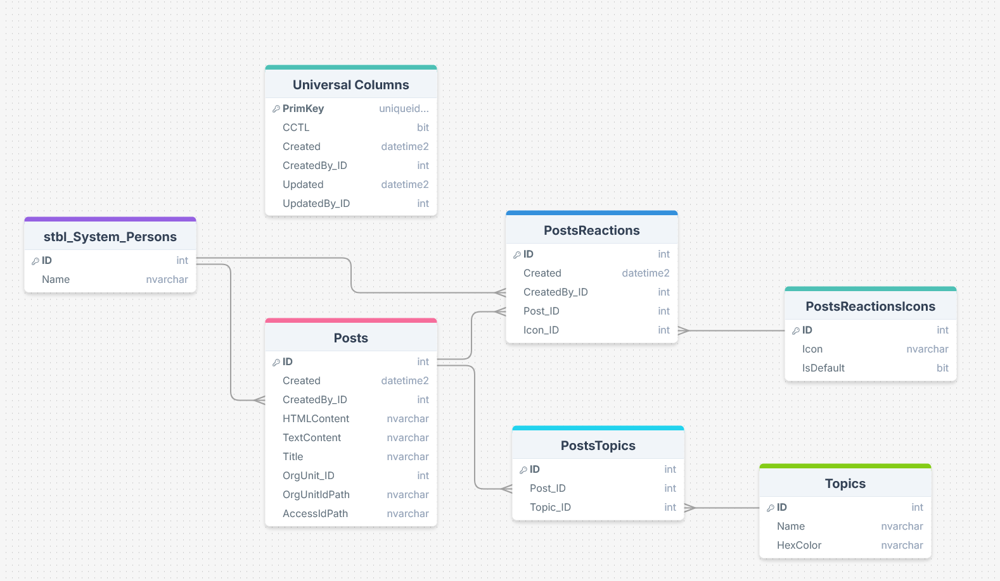
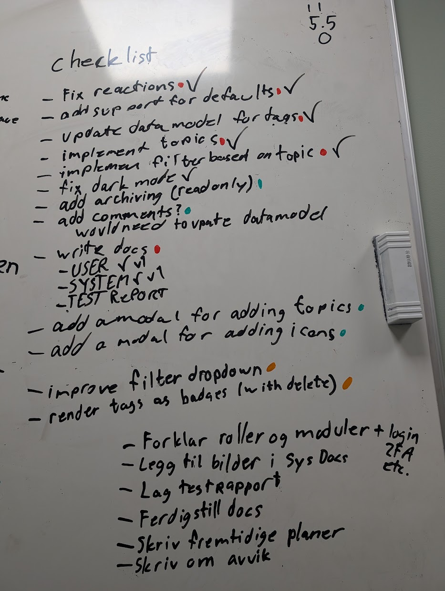

  
Onsdag 05/02

  I dag har jeg planlagt datamodel, skisser for app, og skrevet planleggings dokumentet. Ingenting er utenfor planen så langt.

  
Torsdag 06/02

  
I dag har jeg laget SQL Objektene, som da langt er

  <ul>
    <li>astp_OyvindHaugen_AddOrRemoveReaction</li>
    <li>astp_OyvindHaugen_CreateNewPost </li>
    <li>astp_OyvindHaugen_DeletePost</li>
    <li>atbl_OyvindHaugen_Posts
      <ul>
        <li>
          har lagt til TextContent her for å kunne støtte "preview" av tekst i registeret uten mye frontend prosessering. Egentlig bare en plaintext av HTMLContent.
        </li>
      </ul>
    </li>
    <li>atbl_OyvindHaugen_PostsReactions</li>
    <li>atbl_OyvindHaugen_PostsReactionsIcons</li>
    <li>aviw_OyvindHaugen_PostsReactions
      <ul>
        <li>Er et view som joiner inn Title på post og hvilken reaksjon som er blitt brukt</li>
      </ul>
    </li>
  </ul>
  
I dag har jeg også skrevet SQL Templates som er "maler" for de forskjellige views og triggers. Har skrevet dem siden om løsningen skal utvides i fremtiden sparer dette mye arbeid for utvikler.

  
   
  
I dag har jeg også startet utvikling på appen, og har laget de starten av de tre bildene. Det er et lite avvik fra planen her som er at jeg velger å bruke noe som heter vue-router for å ha en "single page application", slik at det ikke blir loading mellom de forskjellige bildene.

   
  
Utenom de tre avvikene (templates, vue-router, og TextContent) så har jeg følgt planen som jeg la.

  

    Fredag 07/02
  

  I dag har jeg kommet en god del på frontend delen, har lagt til støtte for editering, sletting, og lagring av poster. For editering har jeg implementert FroalaEditor som er en HTML markup editor som er tilgjengelig via Omega365 CTP. Har også skikkelig implemenert vue-router nå slik at hele appen er en sømløs erfaring uten merkbar lasting. Har også lagt til knappene for emoji, men har ikke implementert skikkelig. Nytt view i dag: aviw_OyvindHaugen_Posts. dette inneholder posts og en subselect json av alle reaksjonene. I dag fikk jeg også en endring, som var å legge til kategorisering med Tags. Det var allerede i tankene som en ekstra feature, men nå skal det implementeres som del av kjernefunksjonaliteten. Dette har jeg ikke begynt på, tenker å bli ferdig med reactions først, men jeg har litt ideer hvordan jeg skal implementere det. Tror faktisk ikke jeg har noen avvik i dag overraskende nok. 😆 

  

    Lørdag 08/02
  

  I dag har jeg ferdig implementert reactions, var litt problem med rerendring på load, men det ordnet seg med å sette rett "key" på elementet. Implementering av "default" reaksjoner har jo gjort at jeg har måttet endret litt på viewet som hadde en JSON subquery, her har jeg heller måtte LEFT OUTER JOINet og heller filtrert vekk duplicatene slik at jeg får med default reaksjoner selv om de ikke har vært brukt. Etter jeg ble ferdig med det har jeg planlagt endringen av datamodellen for å støtte det jeg velger å kalle "Tags" som egentlig bare er kategorisering per post. F.eks en post om programmering kan ha tags som "Programming" og "Computer Science" etc.
  

  

    Mandag 09/02
  

  
I dag har jeg ferdigstillt all kjernefunksjonalitet, og løst opp i mange bugs. I aviw_Posts har jeg lagt til ett felt som heter TopicsNames for å lett vise hvilke topics en Post hører til. I dag har jeg også skrevet første utkast av både bruker og system dokumentasjon, siden deadline for den er i morgen. I dag har jeg tatt et valg som tells som et avvik fra planen, som er at jeg ikke skal bruke farger på Topics. Dette var rett og slett bare på grunn av at det ikke er tid til å implementere dette på en god måte med tiden jeg har igjen, så dette har jeg valgt å sløyfe. Men hele veien de par siste dagene har jeg holdt styr ved å bruke en sjekkliste på tavle, og syns dette har hjulpet veldig ved å holde styr på ideer og hva jeg har gjenstående. 

  

