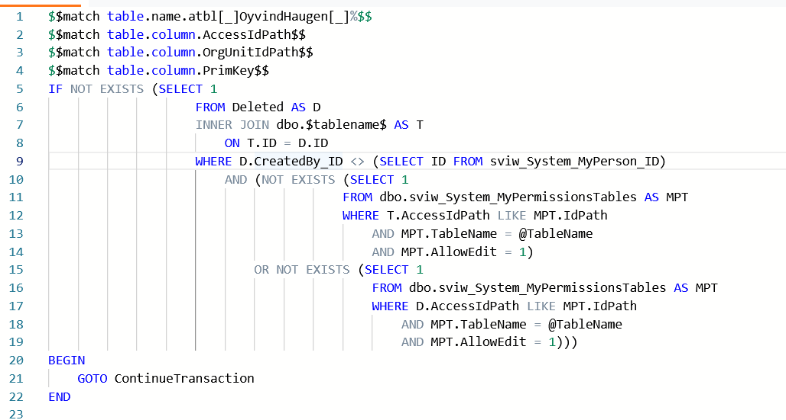

  
Onsdag 05/02

  I dag har jeg planlagt datamodel, skisser for app, og skrevet planleggings dokumentet. Ingenting er utenfor planen så langt.

  
Torsdag 06/02

  
I dag har jeg laget SQL Objektene, som da langt er

  <ul>
    <li>astp_OyvindHaugen_AddOrRemoveReaction</li>
    <li>astp_OyvindHaugen_CreateNewPost </li>
    <li>astp_OyvindHaugen_DeletePost</li>
    <li>atbl_OyvindHaugen_Posts
      <ul>
        <li>
          har lagt til TextContent her for å kunne støtte "preview" av tekst i registeret uten mye frontend prosessering. Egentlig bare en plaintext av HTMLContent.
        </li>
      </ul>
    </li>
    <li>atbl_OyvindHaugen_PostsReactions</li>
    <li>atbl_OyvindHaugen_PostsReactionsIcons</li>
    <li>aviw_OyvindHaugen_PostsReactions
      <ul>
        <li>Er et view som joiner inn Title på post og hvilken reaksjon som er blitt brukt</li>
      </ul>
    </li>
  </ul>
  
I dag har jeg også skrevet SQL Templates som er "maler" for de forskjellige views og triggers. Har skrevet dem siden om løsningen skal utvides i fremtiden sparer dette mye arbeid for utvikler.

  
   
  
I dag har jeg også startet utvikling på appen, og har laget de starten av de tre bildene. Det er et lite avvik fra planen her som er at jeg velger å bruke noe som heter vue-router for å ha en "single page application", slik at det ikke blir loading mellom de forskjellige bildene.

   
  
Utenom de tre avvikene (templates, vue-router, og TextContent) så har jeg følgt planen som jeg la.

