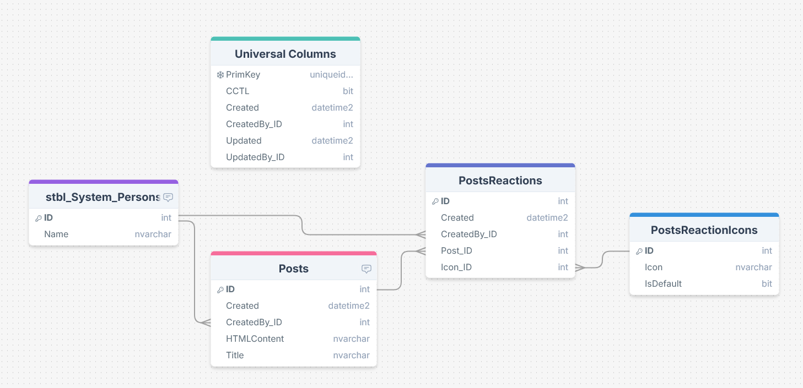
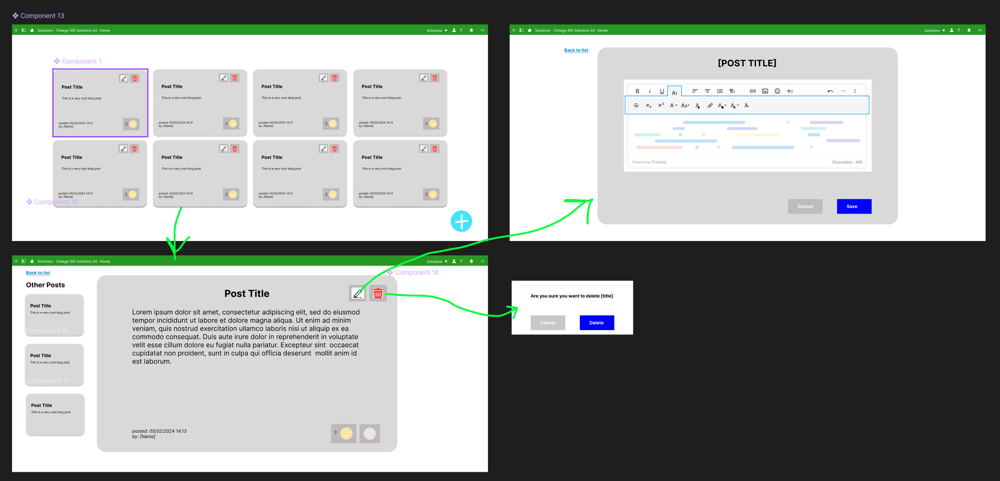

# Planlegging Prøve Fagprøve
  
05/02/2025 - 12/02/2025

## Målet med oppgaven:
Målet med denne oppgaven er å utvikle en enkel applikasjon hvor brukere kan enkelt lage, se, endre, og slette blogg innlegg.

## Påkrevd funksjonalitet og krav:
- **Applikasjonskomponenter:** Det skal være en klient side og en server side hvor innleggene er lagret trygt, og disse blir servert til klient via sikret API.
- **Innleggshåndtering:**  Det skal være mulighet for å legge inn nye innlegg som vises med publiseringsdato, en liste over andre/tidligere innlegg, og mulighet for redigering og sletting av innlegg. Det skal også være mulighet for å "reagere" på ett innlegg, gjerne med tommel opp eller emoji.
- **Lagring:** Innleggene skal lagres på en måte med sikring for av bare den som laget innlegget har mulighet til å redigere eller slette.
- **Design:** Det skal være et enkelt design som er lett å bruke som også følger kravene for universell utforming.

## Sjekkliste kjernefunksjonalitet:
- Lag datamodell ved bruk av DrawSQL
- Lag skisse av app ved bruk av Figma som designverktøy
- Lag et "innleggsregister" med oversikt over tidligere blogginnlegg
- Lag en visnings app med mulighet for nytt innlegg, redigere og slette innlegg (om det er ditt).
- Lage mulighet for å gi likes og/eller reaksjoner
  
## Sjekkliste ekstrafunksjonalitet:
- Kommentarfelt
- Custom Emojis utenom de jeg definerer
- Kategori/topic system som kan filtreres på
- Arkivering
  
## Fremgangsmåte:
1. Jeg skal begynne ved å planlegge datamodellen, layout på app, og hvordan sikkerheten skal virke
2. Lage SQL Objekter
   - Tabeller og trigger
     - Posts (insert, update, og delete)
       - ITrig: standard sjekk på tilgagner
       - UTrig: standard sjekk på tilganger og sjekk om du er personen som laget posten
       - DTrig: standard sjekk på tilganger og sjekk om du er personen som laget posten
     - PostsReactions (insert og delete)
       - ITrig: standard sjekk på tilganger og sjekk om du har reagert på posten fra før
       - UTrig: standard sjekk på tilganger
       - DTrig: standard sjekk på tilganger og sjekk om du har reagert på posten
     - PostsReactionsIcons (readonly)
   - Views
     - aviw_Posts for å joine frem til Created By Name og sjekk om du er eier
     - aviw_PostsReactions for å joine frem hvem som reagerte og hvilket icon de har reagert med, gruppert på Post og Icon
   - Procedures
     - astp_CreateOrUpdatePost
     - astp_DeletePost
     - astp_AddOrRemoveReaction 
3. Lage app visuelt etter layout plan
4. Legge til planlagt kjernefunksjonalitet i appen, som f.eks. mulighet til å legge inn nytt innlegg, redigere o.l.
5. Finpusse og teste at all kjernefunksjonalitet fungerer som forventet
   - test scripting i HTMLContent
6. Vurdere ekstra funksjonalitet og om jeg har tid til å implementere det
7. Kjøre testing av appen og lage rapport på det
9. Skrive system dokumentasjon med "handover" info for evnt neste utvikler
10. Skrive bruker dokumentasjon om hvordan appen fungerer
11. Gå gjennom hvordan jeg presentere det og holde presentasjon for andre lærlinger for gjennomgang

## Skisse:
### Data model:
  
  - Universal Column: dette er standard kolonner som er i alle tabeller i Omega365 CTP, disse kan antas er i alle tabellene, og er nevnt om de har en spesiell bruk
  - stbl_System_Persons: system tabell som kommer med Omega365 CTP og inneholder alle brukere i systemet, skal brukes til å holde styr på hvem som har laget poster, reagert på poster etc.
  - Posts: dette er tabellen hvor teksten i blogginnlegget lagres i HTML format slik at det støtter markdown, sammen med tittel på innlegget. Created og CreatedBy_ID brukes til å holde styr på når innlegget ble laget og hvem som laget det.
  - PostsReactions: dette er tabellen som inneholder alle reaksjoner med foreign key til innlegg, den har også en foreign key videre til hva de reagerte med
  - PostsReactionsIcons: dette er tabellen som inneholder alle mulige reaksjons iconer, IsDefault feltet er der slik at det kan bestemme hvilke som kan brukes uten å åpne menyen

### Grov skisse:
  
  - bildet til topp venstre blir "registeret" hvor du kan se alle innlegg med ca de 50 første ordene, tenker denne skal bruke paging slik at den f.eks viser opp til 20 innlegg om gangen
  - om du trykker på ett innlegg blir du sendt til "visningen" slik at det er større og du får hele innlegget og mulighet for å reagere
  - om du da er "eier" av den posten får du "edit" og "delete" knapp opp. om du prøver å slette får du en confirmation på at du faktisk vil det. Om du trygger på rediger så får du opp redigerings bildet.
  - i redigerings bildet er det en froala editor som støtter markdown slik at du kan skrive HTML og få gode formatterings muligheter. Her har du en lagre og slette knapp.

## Tidsskjema:

  

      Onsdag 05/02
  

  <ul>
    <li> Gjennomgang fagprøve - 1.5t </li>
    <li> Planlegge og skrive plandokument - 2.5t </li>
    <li> Lage datamodell, og tenke over views og procedures som trengs - 2t </li>
    <li> Lage skisse av app i Figma - 1.5t </li>
    <li> Levere dokumentasjon, datamodell og skisser - Før 17:00 </li>
  </ul>

  

    Torsdag 06/02
  

  <ul>
    <li>Lage tabeller til datamodellen, views og procedures - 7.25t</li>
    <li>Dokumentere og reflekter over eventuelle endringer fra planen - 0.25t</li>
  </ul>

  

    Fredag 07/02
  

  <ul>
    <li>Ferdigstill objektene til datamodellen og begynn app utvikling - 7t</li>
    <li>Dokumentere og reflekter over eventuelle endringer fra planen - 0.5t</li>
  </ul>

  

    Lørdag 08/02
  

  <ul>
    <li>Fortsett app utvikling - 7t</li>
    <li>Dokumentere og reflekter over eventuelle endringer fra planen - 0.5t</li>
  </ul>

  

    Søndag 09/02
  

  <ul>
    <li>Fortsette implementasjon av app og vurder eventuell ekstrafunksjonalitet - 7t</li>
    <li>Dokumentere og reflekter over eventuelle endringer fra planen - 0.5t</li>
  </ul>

  

    Mandag 10/02
  

  <ul>
    <li>Ferdigstill funksjonalitet - 4.5t</li>
    <li>Begynne på system dokumentasjon - 2t</li>
    <li>Dokumentere og reflekter over eventuelle endringer fra planen - 1t</li>
  </ul>

  

    Tirsdag 11/02
  

  <ul>
    <li>Fullfør system dokumentasjon, brukerveileding, og test rapport - 7.5</li>
  </ul>

  

    Onsdag 12/02
  

  <ul>
    <li>Presentere løsning for sensor og prøvenemd</li>
  </ul>

## Teknologi:

- Omega 365 CTP (Core Technology Platform)
  Grunnet innebygd sikkerhet og trygt API. Det er også bedriftens standard.
  - VueJS 3
  - Bootstrap 5.3
  - Microsoft SQL Server
- GitHub
  - For dokumentasjon som er lett å dele med andre
- DrawSQL
  - For visualisering av datamodell
- Figma
  - For skisse av layout på applikasjonen
  

## Kostnader:
- Timerate lærling: 155,-
  - Estimert total pris lærling: 5 arbeidsdager * 7.5 timer * 155 = 5812.50,-
- Basic Omega 365 Instans per måned:
  - Hosting: 8000,-
  - Lisens: 25000,-
  - Kost per bruker: 380,-
- Estimert total pris: 38 812.50,- + 380 * antall brukere

## Kilder:
- Tor Halvorsen Aasheim (faglig leder)
- [Vue Docs](https://vuejs.org/)
- [SQL Server Docs](https://learn.microsoft.com/en-us/sql/?view=sql-server-ver16)
- [Omega 365 Docs](https://docs.omega365.com)
- [Bootstrap 5.3 Docs](https://getbootstrap.com/docs/5.3)
- [Stack Overflow](https://stackoverflow.com/)
- [ChatGPT](https://chatgpt.com)
