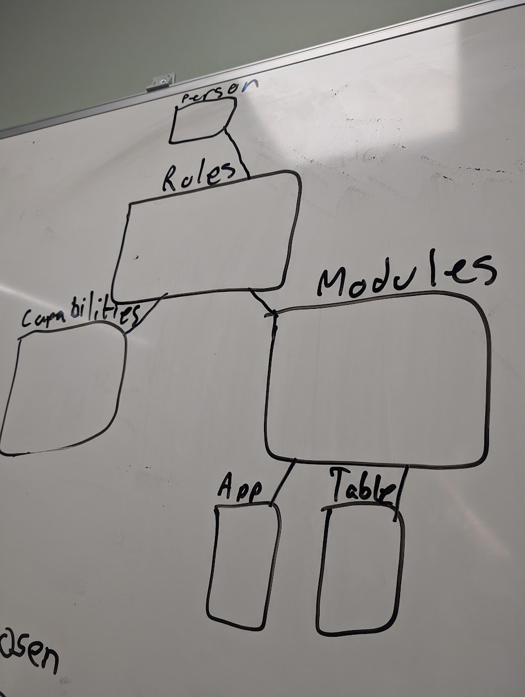
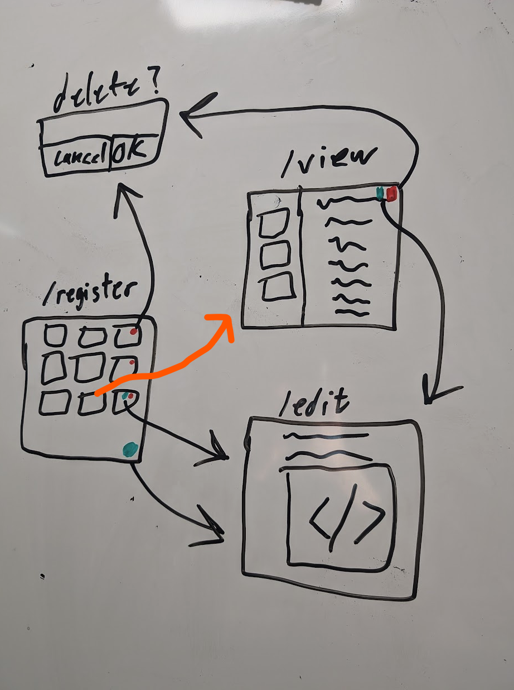
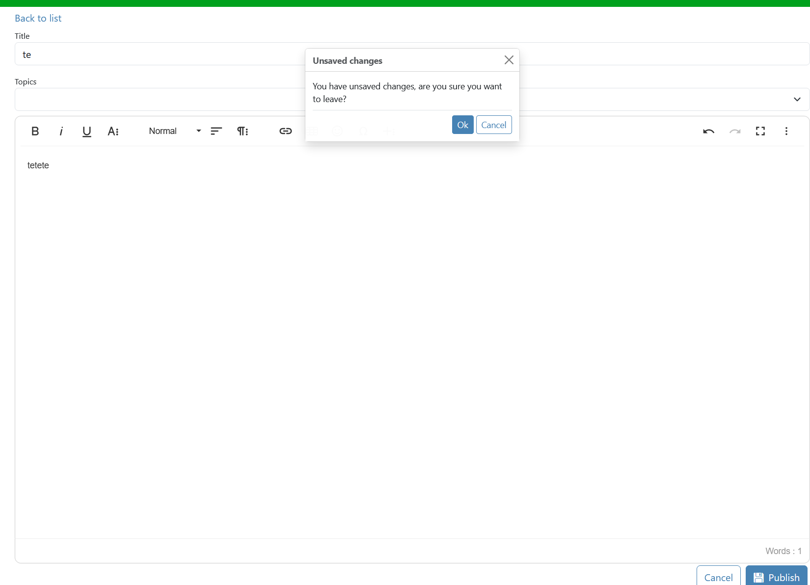

# System Dokumentasjon

## Innhold
- Oppsummering applikasjon
- Teknologier
- Database modell
- Sikkerhet
- Frontend
- Problemstillinger
- Planen videre
- Avvik fra plan

  

    Oppsummering applikasjon
  

  
Oppgaven denne applikasjonen skal utføre er å være et blogg verktøy. Målet var å kunne lage, endre, og slette blogg innlegg. Det skulle også være en måte å gi likes på, sammen med mulighet til å filtrere på kategorier. 

  

    Teknologier
  

  <ul>
    <li>Omega 365 CTP</li>
    <li>Microsoft SQL Server</li>
    <li>Vue.js 3 med TypeScript</li>
    <li>Bootstrap 5.3</li>
  </ul>

  

    Database modell
  

  
  
Det er egentlig en ganske enkel og konsis datamodell. Den består av 5 custom tabeller og 1 Omega 365 system tabell;

  <ul>
    
  

    

      Tabeller
    

    <ul>
      <li>Posts - hvor innholdet til poster er lagret sammen med metadata som hvem som laget posten, dato, og tittel.</li>
      <li>Topics - dette er tabellen som har alle kategoriene i seg, Posts har FK til denne.</li>
      <li>PostsTopics - dette er tabellen som linker sammen Posts og Topics, med FK til begge de tabellene.</li>
      <li>PostsReactionsIcons - dette er tabellen som har alle reaksjonsikonene som kan brukes på innlegg. Her ligger også metadata som om det er en default</li>
      <li>PostsReactions - dette er tabellen der alle reaksjoner legges inn, med FK til Posts og Icons</li>
      <li>Persons - dette er en system tabell som oppbevarer info om alle personer som er registrert i systemet. Alle tabellene har en FK til denne for informasjon om hvem som har laget/oppdatert data.</li>
    </ul>
  

  

    

      Views
    

    <ul>
      <li>aviw_Posts - view som henter ut metadata om hvem som har laget innlegget, hvilke reaksjoner som er gjort, og hvilke topics som tilhører.</li>
      <li>aviw_PostsTopics - view som henter metadata om alle valgte topics for innleggene</li>
    </ul>
  

  

    

      Procedures
    

    <ul>
      <li>astp_CreatePost - dette er prosedyren som kjøres når ett nytt innlegg blir laget, tar inn parameter: OrgUnit_ID, TextContent, HTMLContent, Title, TopicsJSON</li>
      <li>astp_DeletePost - dette er prosedyren som kjøres når ett innlegg skal slettes, sletter fra alle tabeller med dependencies på Posts, tar in parameter: Post_ID</li>
      <li>astp_UpdatePostTopics - dette er prosedyren som kjøres når en endring blir gjort på topics på eksisterende innlegg, tar inn parameter: Post_ID, TopicsJSON</li>
      <li>astp_AddOrRemoveReaction - dette er prosedyren som kjøres når du trykker på en reaksjon, basert på om raden eksisterer (Icon_ID, Post_ID, CreatedBy_ID) velger den om den skal slette eller legge inn ny rad, tar inn parameter: Icon_ID,  Post_ID</li>
    </ul>
  

  </ul>

  

    Sikkerhet
  

  
Hele løsningen støtter seg på sikkerheten i Omega 365 CTP. Kjernekonsept i sikkerheten er moduler, capabilities, og roller. En modul er som et tilgangskort som sier hva du ha tilgang til i.e. hvilke tabeller og apper du skal ha tilgang til. Roller kan da videre kobles opp til disse, men en rolle er ikke begrenset til bare en modul, den kan ha flere forskjellige, som blir som nøklene på et nøkkelknippe. En bruker kan få tildelt roller basert på hvilke tilganger de skal ha. Capabilities er "spesialtilganger" som blir gitt til noen individe roller for enda strengere sjekker. 

  
  
I Omega 365 CTP har vi flere måter å autentisere på, mest vanlig er SQL login eller Microsoft login. Med en SQL login som består av ett brukernavn og passord, kjøres ett sikkert API kall til SQL serveren for å autentisere brukeren. Med Microsoft login blir dette sendt til Microsoft og blir sjekket av dem. Om du blir autentisert av Microsoft returnerer de en token slik at Omega 365 vet at du er autentisert.

  
Utover dette er to faktor autentisering (2FA) høyst anbefalt. Det er flere forskjellige tilgjengelige valg som: SMS, Email, Time-based One Time Password (TOTP), og Passkey. SMS og Email blir generelt sett på som de minst sikre, men det er bedre enn ingen 2FA. TOTP er basert på engangskoder som kommer opp i apper som Microsoft Authenticator og Google Authenticater når du har registrert en side. Passkeys er et "passwordless" alternativ der innloggingen din er direkte koblet til en enhet du eier som f.eks telefonen din, og dette brukes for å verifisere at du er du.

  
Dette gjør det til ett lett oversiktlig system som kan tilpasses til mange forskjellige bruk.

  
Sikkerheten i views er egentlig ganske enkel siden den sjekker bare om du lesetilgang på tabellen. For økt sikkerhet har brukere aldri direkte tilgang til tabeller. I stedet brukes views, ofte via en atbv som er automatisk generert for alle nye tabeller. "atbv" står for Application Table View og brukes for å kontrollere hva en bruker kan se.

  
Sikkerheten i triggere er litt mer avansert, siden her må det sjekkes på om du har redigering/slette tilganger. På tabellene som relaterer til Posts så sjekker den alltid om <em>du</em> er eier, siden bare eieren av et innlegg kan redigere og/eller slette det. Du skal allerede bli stoppet fra appen, men bør alltid ha en ekstra sjekk i databasen 😊 Dette er sikkerheten de fleste prosedyrene henger seg på. 

  
All sikkerheten her ble skrevet med bruk av noe som heter SQL Templates, som gjør at du kan skrive en "template" og alle tabeller som oppfyller kravene får da den templaten i den autogenererte seksjonen. Dette sparer en del tid spesielt om du plutselig skal lage et par nye tabeller, eller vil gjøre endringer for mer enn en trigger/view

  
For blogg løsningen har jeg satt opp to roller; "Oyvind Blog User" og "Oyvind Blog Admin". Praktisk i appen er det ikke så mye forskjeller, men en admin har også tilgang til å f.eks legge til nye ikoner i PostsReactionsIcons og nye Topics i Topics tabellen. Dette har jeg egentlig gjort for å fremtidssikre løsningen for når eventuelt adminastrive brukere skal implementeres.

  

    Frontend
  

  
Noe som skiller denne appen litt fra andre apper er at den bruker noe som heter "vue-router", dette gjør at det skal kjøres som en "single page application (SPA)". Siden hele appen kjører som en SPA, er det nesten null i lastetid, og appen føles veldig sømløs. Det er satt opp noen fallback mekanismer som 404 Not Found side, og redirigering om du prøver å gå til "/", så leder den deg til "/register". Ulempen med "vue-router" er jo at det er vanskligere å feilsøke når du har feil å router nivå, men fordelene utveier ulempene.

  
Denne appen består av 3 primær komponenter, som er: Register, View, og Edit. Som navnene beskriver så er det for å se en oversikt over alle innlegg (med filtermuligheter), se hele innlegg på en større skjerm (med anbefalinger for andre innlegg på siden), og redigering av innlegg.

  
Veldig sentralt i denne appen er BlogCard komponenten, den sørger for mesteparten av det viselle. Hele Register og View bruker denne på flere steder, og siden dette er en komponent er den lett å gjenbruke og gjøre endringer lett i hele løsningen.

  
Siden denne appen er skrevet med bruk av rammeverket Omega 365 CTP, så brukes ett konsept som heter DataSources istedenfor direkte koblinger til en SQL Server. Disse DataSourcene er egentlig bare ett JSON-object som sendes inn til det sikrete APIet slik at den kjører verifisering og sender forespørselen videre til SQL Serveren. Ved bruk at dette konseptet sparer det mye av bryet som er å sette opp direkte koblinger, som da ikke er sikret.
  
Appen bruker også noe som heter Dynamic Loading, som gjør at den i starten ikke laster så mange innlegg, men kan raskt laste flere innlegg om bruker ønsker det og trykker på "Load more". Dette konseptet er bedre kjent som Pagination.

  
Filteringen fungerer ved å ha to "paths" fra SQL Viewet som da er Topics (ID) og TopicsNames (Name). Topics brukes til å filtrere på med en "LIKE" clause i filterstringen. TopicsNames brukes for å rendere hvilke Topics et innlegg er kategorisert som.

  
Reaksjoner fungerer ved at SQL Viewet lager en JSON av alle emojier som er blitt brukt/skal være tilgjengelige. Utifra det JSON-objectet renderer den reaksjonene som en "badge" på hvert innlegg. Det oppdaterer i DOMen dynamisk ved bruk at attributen som heter "key", som gjør at hver gang den endrer seg lastes komponenten på ny. I dette tilfellet står "key" som raden sitt Reactions JSON object, siden det endrer seg når du trykker på en reaksjon.

  

  

    Problemstillinger under utvikling
  

  <ol>
    <li>Vue Router - det tok litt lenger tid enn planlagt for å sette opp Vue Router siden dette var noe jeg ikke hadde brukt før. Det ble noen timer med lesing av dokumentasjon, men etter litt for mange timer fikk jeg det på plass.</li>
    <li>
      Dirty håndtering - har hatt litt problemer med håndteringen av om en post i redigeringsmodus er "dirty" eller ikke. Etter litt testing kom jeg frem til at å lage en funksjon som sammenlignet "draft" dataen med dataen i database var den letteste og mest effektive løsningen.
      
    </li>
    
  </ol>

  

    Planen videre
  

  
Her er tingene jeg hadde planlagt videre, men som jeg ikke fikk tid til: 

  <ul>
    <li>Kommentarfelt</li>
    <li>Arkivering (at poster ikke kommer opp lenger)</li>
    <li>Søkefelt</li>
    <li>Mulighet til å legge til Icons og Topics</li>
    <li>Et admin skjermbilde der en admin kan administrere poster</li>
    <li>Farger på Topics og rendering som Badges</li>
    <li>Taginput for Topics</li>
    <li>Algoritme for å anbefale "Other Posts" basert på Topic</li>
    <li>Mulighet til å filtrere basert på forfatter av et innlegg</li>
  </ul>

  

    Avvik fra plan
  

  
Her er avvikene jeg har hatt fra original planen med begrunnelse: 

  <ul>
    <li>Vue Router - istedenfor å lage forskjellige skjermbilder og laste de via IFrames valgte jeg å bruke Router siden det ville la meg lage en SPA (Single Page Application) som sparer på lastetid.</li>
    <li>astp_CreateOrUpdatePost - denne fikk i helt den planlagte bruken, for den skulle originalt brukes på save også, men jeg endte opp med å bare bruke den innebygde funksjonaliteten på DataSource, og heller bare bruke denne for å lage nye poster.</li>
    <li>aviw_PostsReactions - denne ble sløyfet for jeg valgte heller å ha en sub select i aviw_Posts formattert som JSON, siden det var lettere for dynamisk rendering av reaksjoner.</li>
    <li>TextContent - i original planen var det ikke planer om å ha ett felt som TextContent, men jeg fant ut at for å ha en "preview" i registeret var det mye lettere å bare lagre ett felt istedenfor å kjøre tung SQL logikk for å fjerne tags fra HTMLContent.</li>
    <li>SQL Templates - i planen var det ikke ment å bruke SQL Templates, men jeg fant ut at for fremtidssikring og eventuelle andre endringer som krever nye tabeller vil det spare en god del tid å bare skrive templates som autogenerer standard sikkerhets sjekker.</li>
    <li>Topics farger - I planen etter endringen om Topics kom, var planen å implementere farger for Topics for å kunne fargekode dem, men grunnet tidspress var det ikke tid til å implementere dette.</li>
  </ul>

