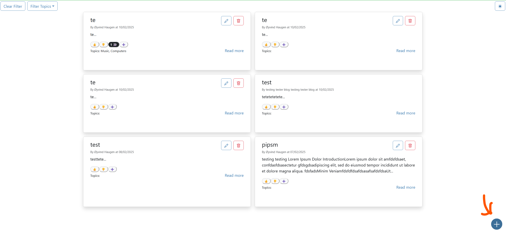
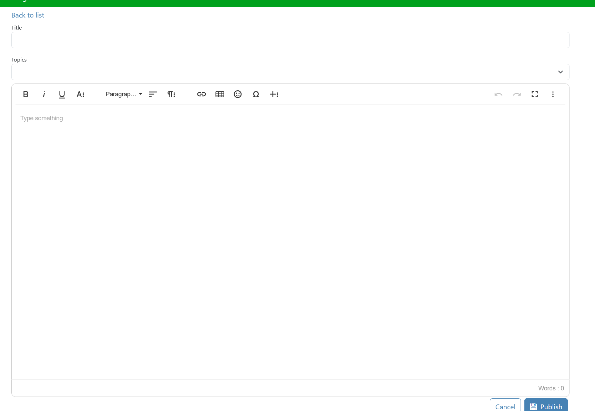
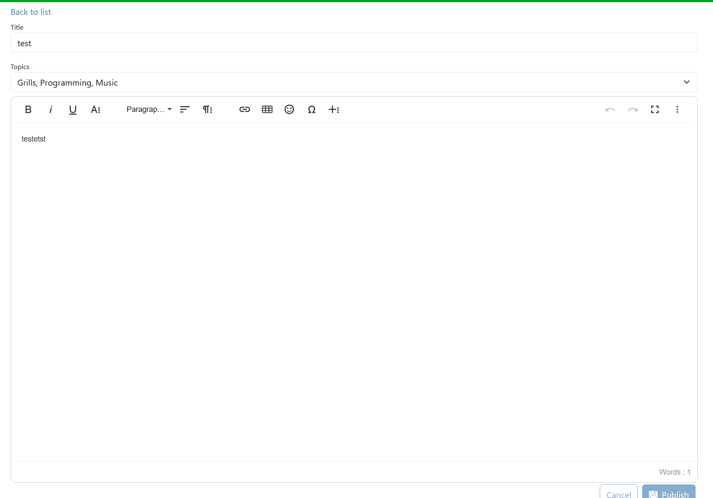
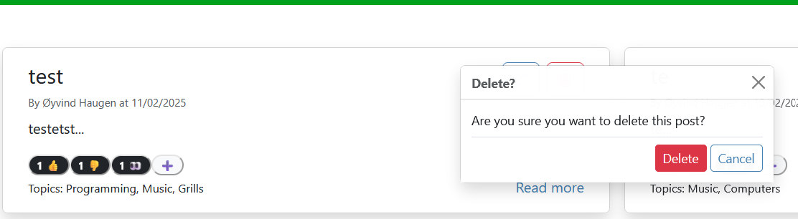
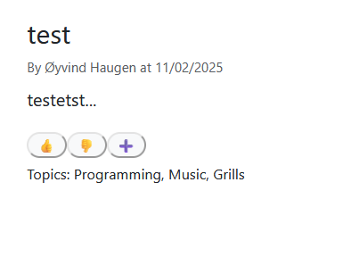
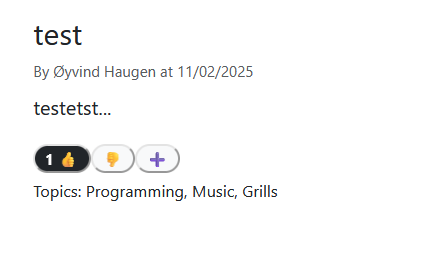
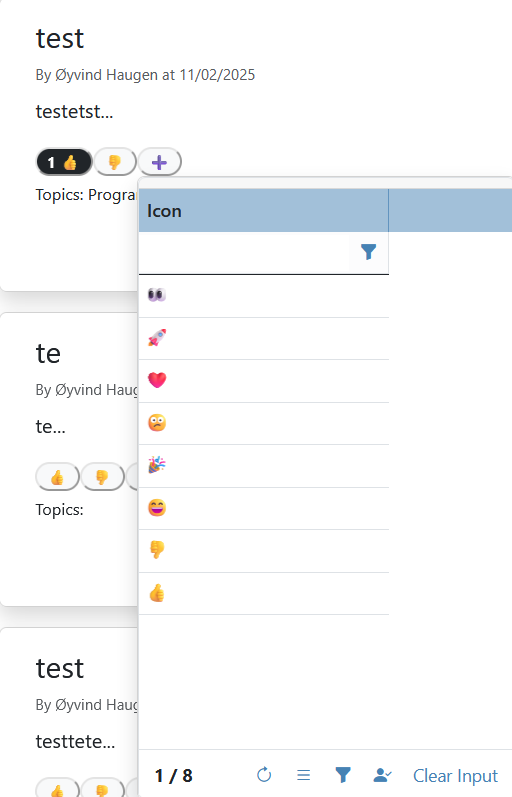
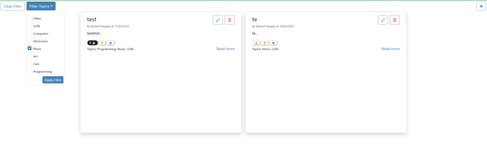

# Test Rapport

## Plan:
Utføre grundig test av alle funksjonene i appen og beskrive hvordan de burde oppføre seg, og om de ikke oppfører seg rett, dokumenter hva som ikke fungerer og eventuelle fikser.

<table>
  <th>Funksjon</th>
  <th>Forventet oppførsel</th>
  <th>Resultat</th>
  <th>Bilde</th>
  <th>Eventuelle fikser</th>
  <th>Status</th>
  <tr>
    <td>Lage nytt blogg innlegg</td>
    <td>Ta deg til redigerings siden for oppretting av nytt innlegg</td>
    <td>Tar deg til redigering siden</td>
    <td></td>
    <td></td>
    <td>✅</td>
  </tr>
  <tr>
    <td>Utfylling av detaljer for nytt innlegg</td>
    <td>At du kan fylle ut innhold i nytt innlegg</td>
    <td>Du kan fylle ut innhold og publisere det nye innlegget</td>
    <td></td>
    <td></td>
    <td>✅</td>
  </tr>
  <tr>
    <td>Redigering av eksisterende innlegg (som er ditt)</td>
    <td>Ta deg til redigerings siden med gammelt innhold liggende der.</td>
    <td>Du kan endre gammelt innhold som fyller seg inn automatisk når du kommer inn på siden.</td>
    <td></td>
    <td></td>
    <td>✅</td>
  </tr>
  <tr>
    <td>Sletting av eksisterende innlegg (som er ditt)</td>
    <td>Det skal gi deg mulighet til å avbryte sletting, og så slette ett innlegg som du eier om du godtjener.</td>
    <td>Posten ble slettet og ble fjernet fra registeret</td>
    <td></td>
    <td></td>
    <td>✅</td>
  </tr>
  <tr>
    <td>Se en post i detalj</td>
    <td>Det skal gi deg en egen visning for å se hele innlegget, med andre innlegg tilgjengelig på venstresiden.</td>
    <td>Den viser det fint formattert, med andre innlegg tilgjengelige på siden.</td>
    <td></td>
    <td></td>
    <td>✅</td>
  <tr>
    <td>Gi likes/kudos/reaksjoner</td>
    <td>Når du trykker på et ikon skal det visuelt vise at du har brukt det</td>
    <td>Det viser visuelt at du har reagert med at mengden reaksjoner oppdaterer og bakgrunnen blir mørk for å indikere at du har </td>
    <td></td>
    <td>Litt delay fra når du trykker til det registrer, kunne nok ha gjort noe lokal caching som ikke venter på databasen.</td>
    <td>✅ fungerer, men har et lite delay problem</td>
  </tr>
  <tr>
    <td>Gi likes/kudos/reaksjoner utover tommel opp og tommel ned</td>
    <td>Menyen skal åpne når du trykker på pluss ikonet, slik at du får et større valg av reaksjoner</td>
    <td>Menyen åpner og du får et større valg av reaksjoner</td>
    <td></td>
    <td>Mangler mulighet for å legge til helt egne reaksjoner. Litt delay fra når du trykker til det registrer, kunne nok ha gjort noe lokal caching som ikke venter på databasen</td>
    <td>✅ fungerer, men med noen ekstra funksjonalitet som mangler.</td>
  </tr>
  </tr>
  <tr>
    <td>Skal kunne sette filter for å bare få opp innlegg i valgte kategorier.</td>
    <td>Innleggene som vises skal filtreres til de kategoriene som er valgt.</td>
    <td>Innleggene blir filtrert basert på valgt kategori</td>
    <td></td>
    <td>Burde ha lagt til antall innlegg per kategori</td>
    <td>✅ fungerer, men mangler ekstra funksjonalitet</td>
  </tr>
</table>
